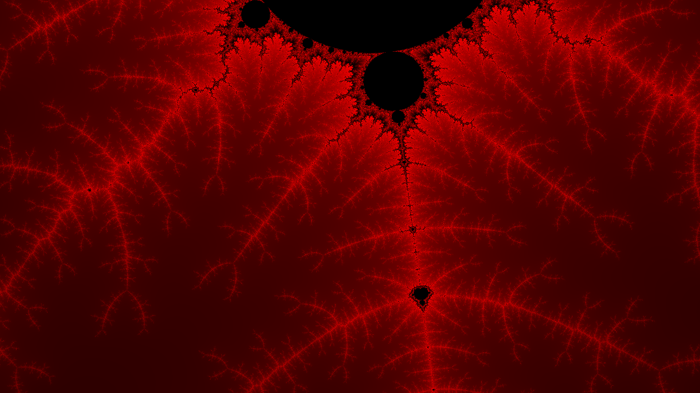
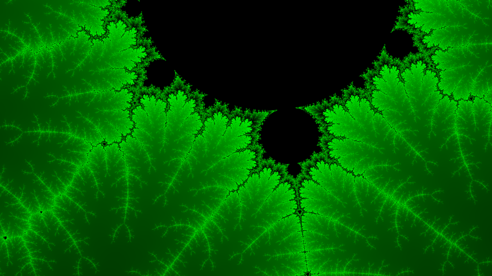
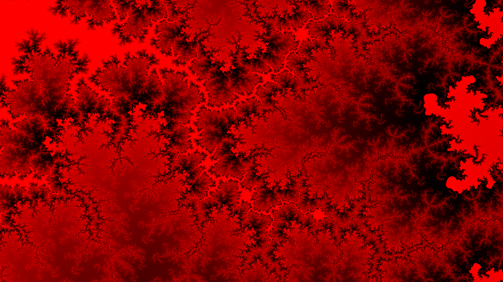
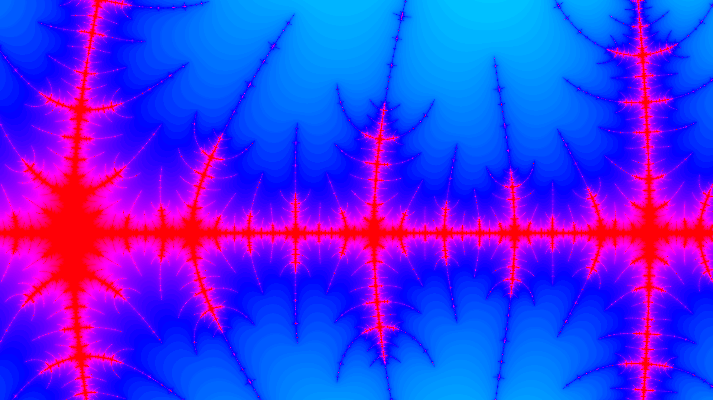

# Mandelbrot
A program written in Java to allow zooming and panning around the mandelbrot set. 
It includes multiple different types of coloring algorithms and customizable color. 
Once a cool looking region is found, it can be exported as an image and used as a desktop background.

### Sample Images

