# Fractal Background Creator
A Java program which allows zooming and panning around the Mandelbrot and Burning Ship fractals. 
It includes multiple different types of coloring algorithms and customizable color. 
Once a cool looking region is found, it can be exported as an image and used as a desktop background.

### Usage
Click and drag to pan around the fractal image. Use the mouse to scroll in and out. To manager the color gradient, click and drag on one of the selectors (image below).

To change a selectors color, double click on it or select it and press the color panel to the right. To delete a selector, select it and then press the backspace or delete key on the keyboard. Once an image is found, press print <!--and select the desired resolution -->to print it.

### Sample Images
<!--

--->

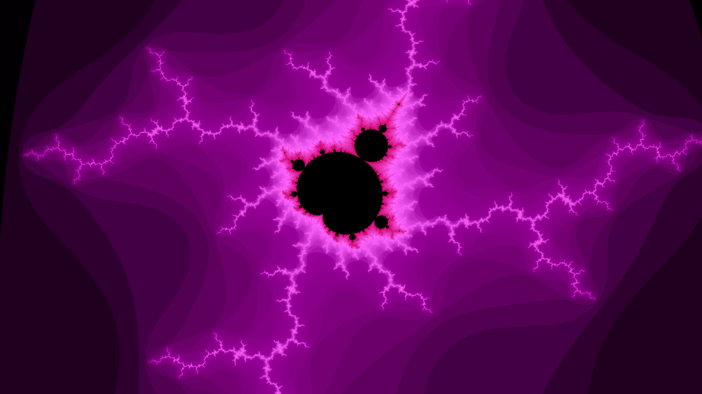
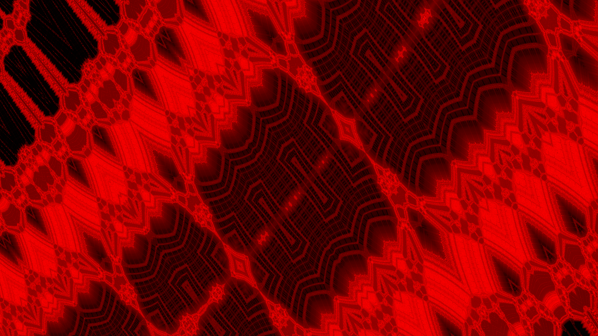
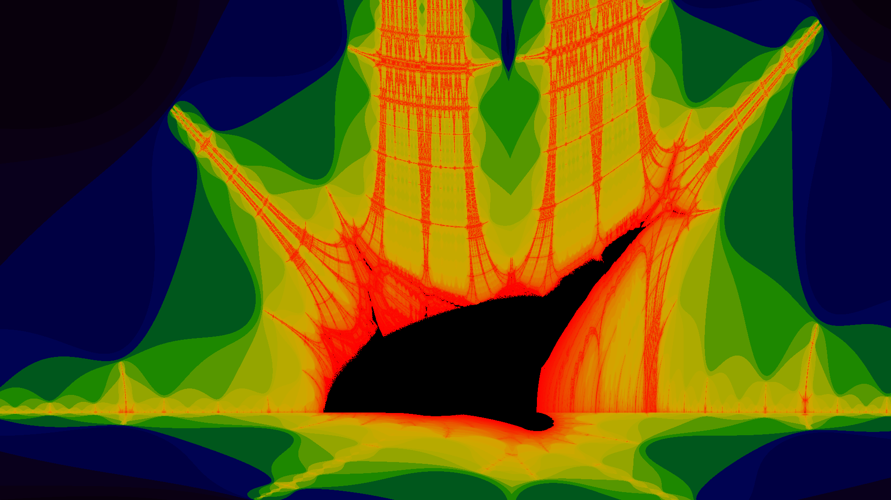
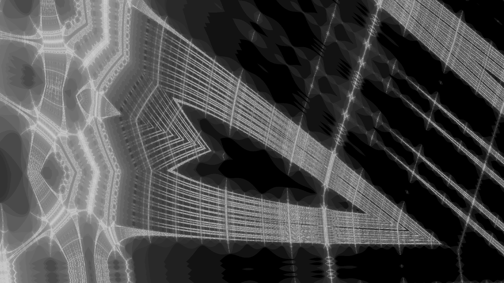
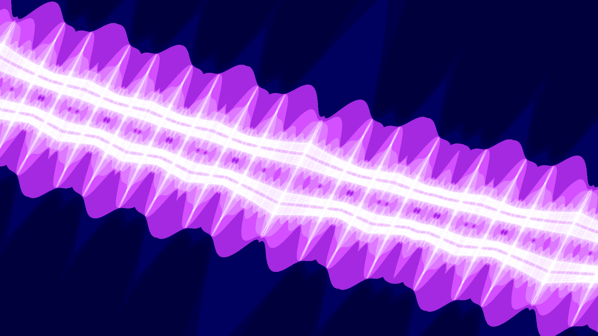
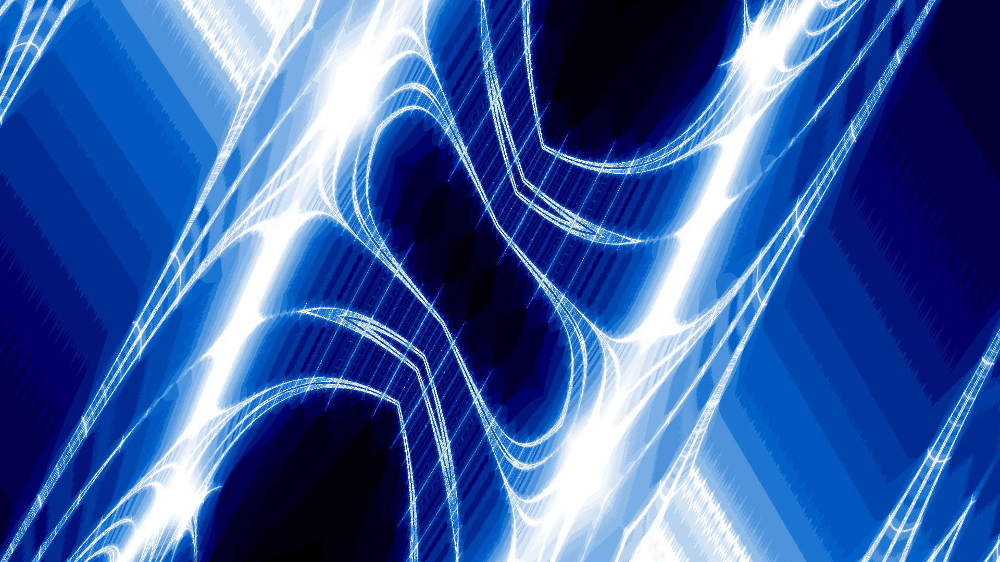
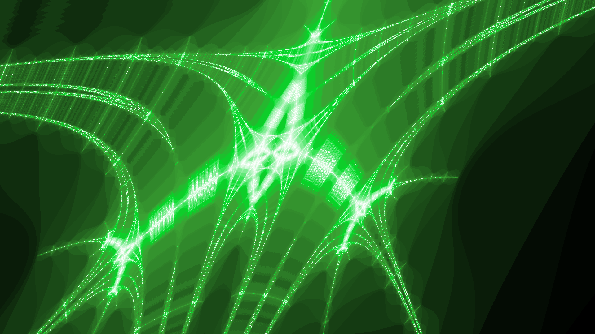

<!-- 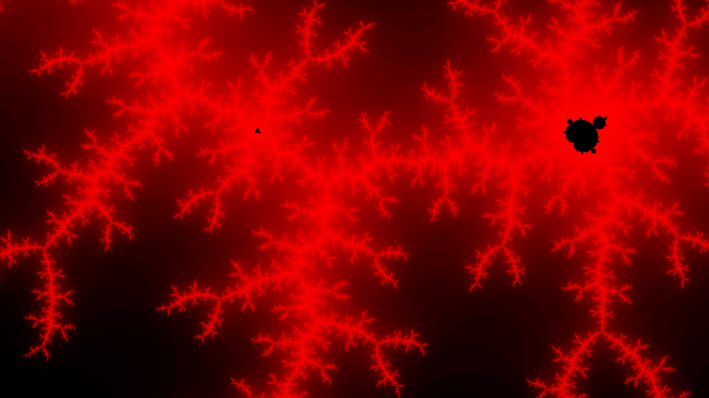 -->
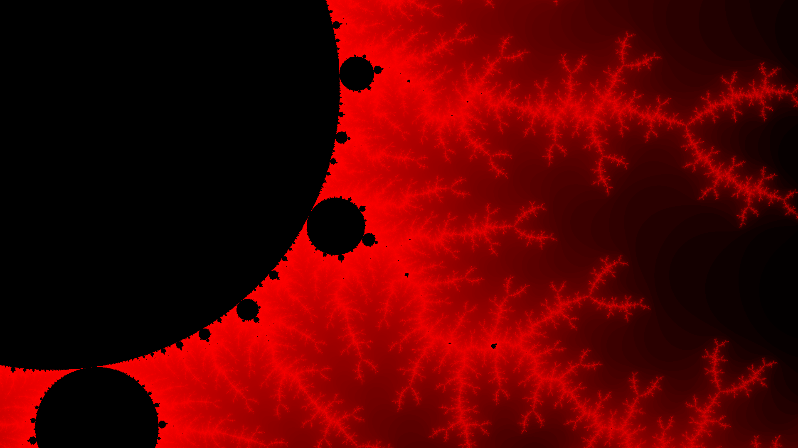
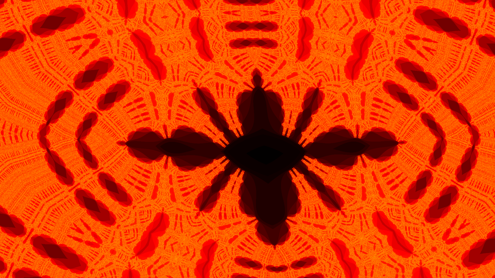
<!-- 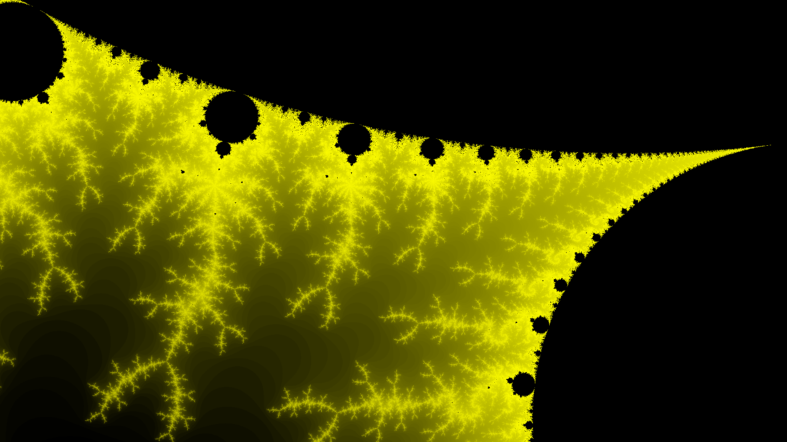 -->
<!-- 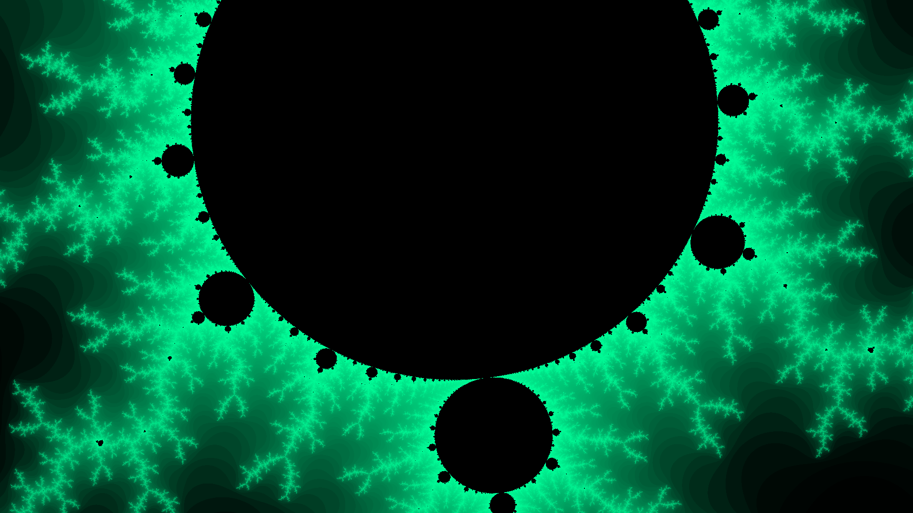 -->
<!-- 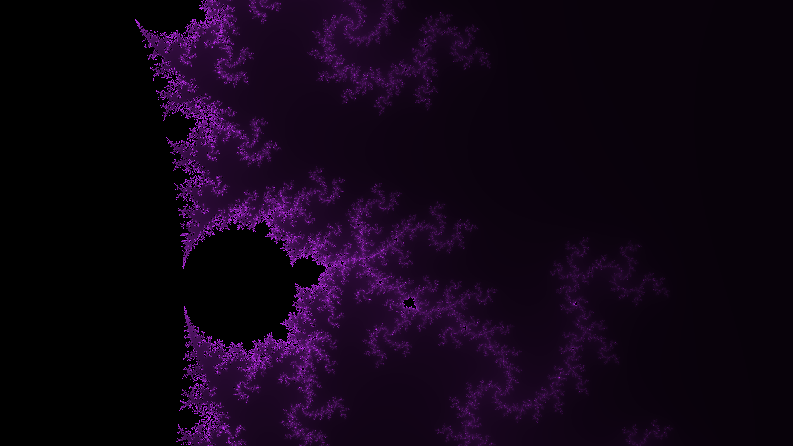 -->
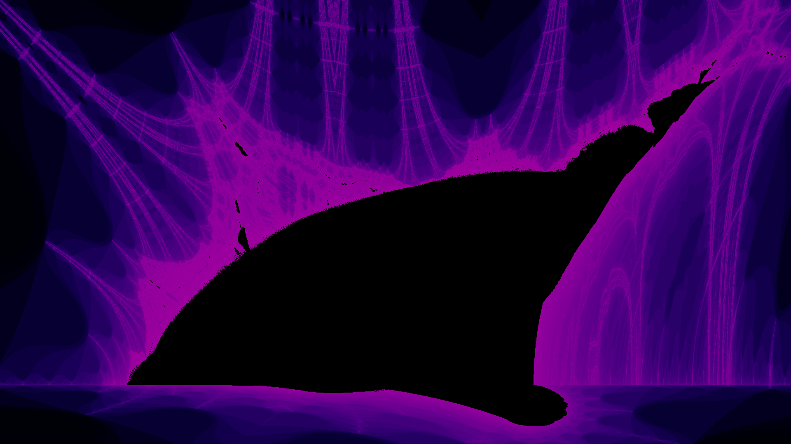
<!-- 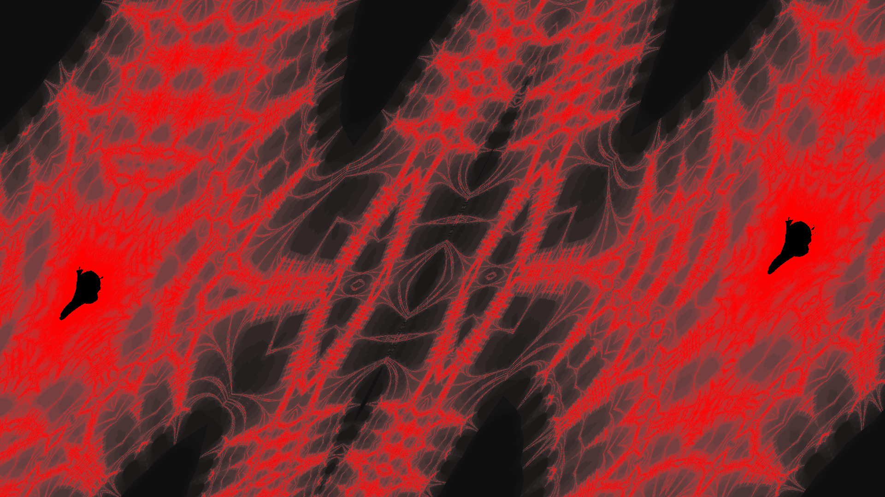 -->

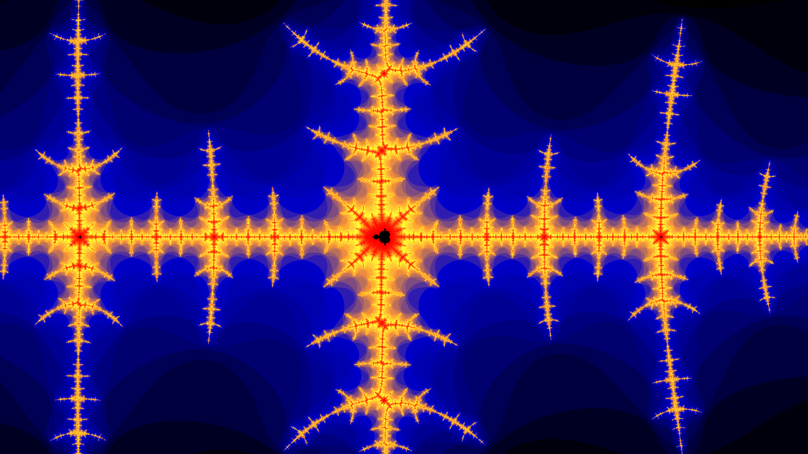
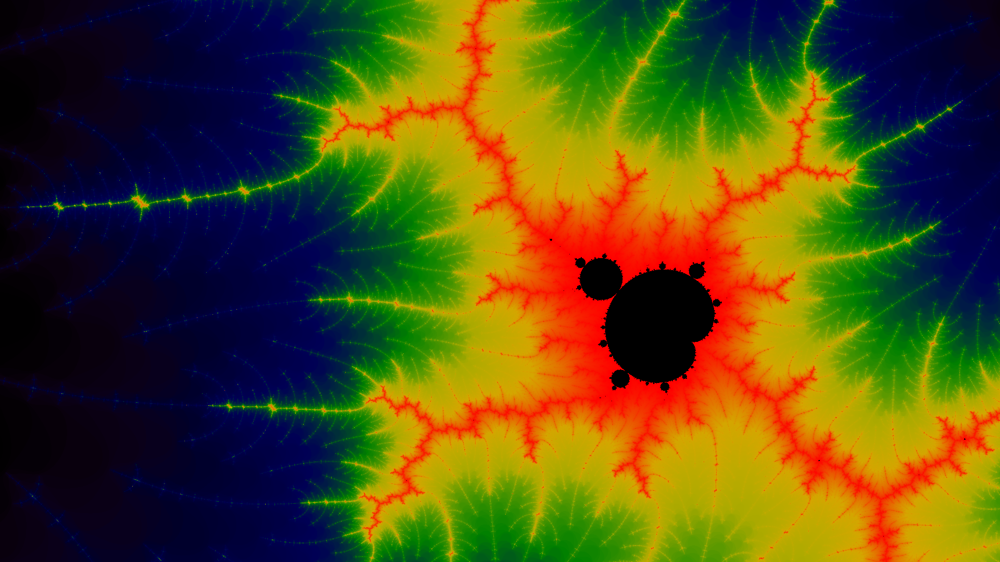
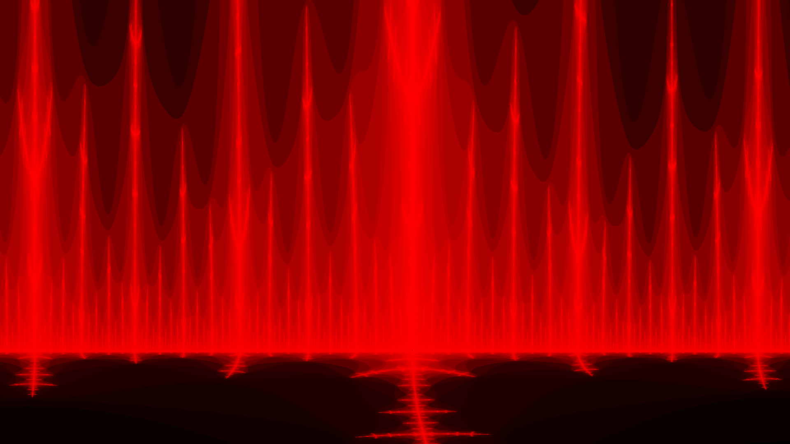
